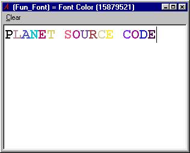



## Fun\_Font v0\.1

### Description

Nothing so advance. What it does is change the font color everytime the user type a word.Don't know what to do with it, maybe good fo IM, chat app. .....feedback please.....
 
### More Info
 

             |
---                |---
**Submitted On**   |2002-06-29 09:27:56
**By**             |[Mil\-X Pro](https://github.com/Planet-Source-Code/PSCIndex/blob/master/ByAuthor/mil-x-pro.md)
**Level**          |Beginner
**User Rating**    |4.3 (13 globes from 3 users)
**Compatibility**  |VB 5\.0, VB 6\.0
**Category**       |[String Manipulation](https://github.com/Planet-Source-Code/PSCIndex/blob/master/ByCategory/string-manipulation__1-5.md)
**World**          |[Visual Basic](https://github.com/Planet-Source-Code/PSCIndex/blob/master/ByWorld/visual-basic.md)
**Archive File**   |[Fun\_Font\_v9999262820\.zip](https://github.com/Planet-Source-Code/mil-x-pro-fun-font-v0-1__1-36383/archive/master.zip)

